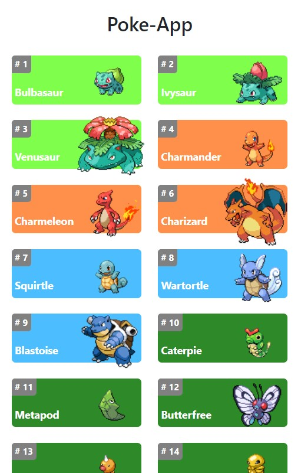
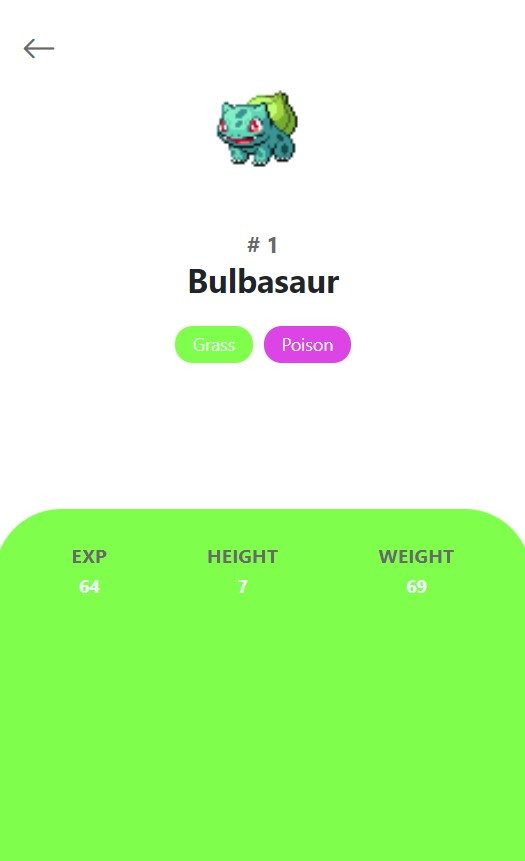

# react-poke-app
***
Open https://imdamiandev-react-poke-app.netlify.app/ to view it in your browser.
***
## Table of Contents
1. [General Info](#general-info)
2. [Technologies](#technologies)
3. [Installation](#installation)
### General Info
***
App creada con la tecnologia react.
Utiliza fetch para consumir datos de la API de https://pokeapi.co/. en su version 2.

Se disponibiliza una vista principal con cards de los pokemones con la informacion base de estos(id, nombre e imagen).

Al seleccionar cualquiera de ellos se disponibiliza una vista detalle del pokemon correspondiente.

El despliegue se realizo con netlify y puede abrir https://imdamiandev-react-poke-app.netlify.app/ para verlo en su navegador.
### Screenshot


## Technologies
***
A list of technologies used within the project:
* [React](https://es.reactjs.org/): Version 18.2
* [Bootstrap](https://getbootstrap.com/): Version 5.3
## Installation
***
A little intro about the installation. 
```
$ git clone https://github.com/ImDamianDev/react-poke-app.git
$ cd ../react_poke_app
$ npm install
$ npm start
```
